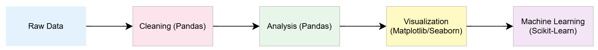
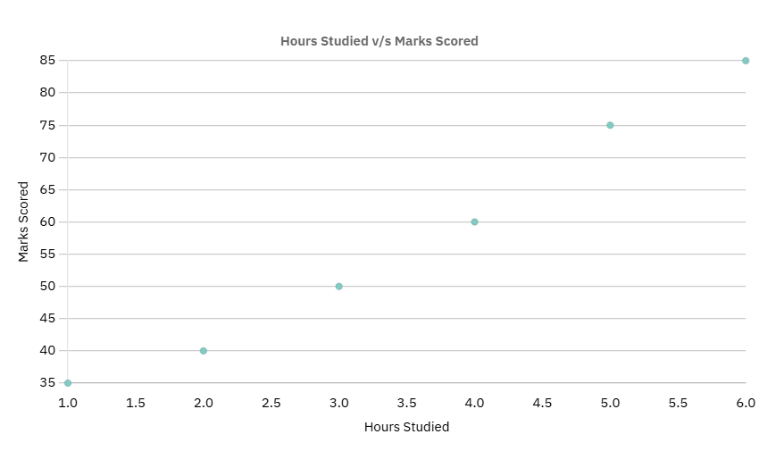
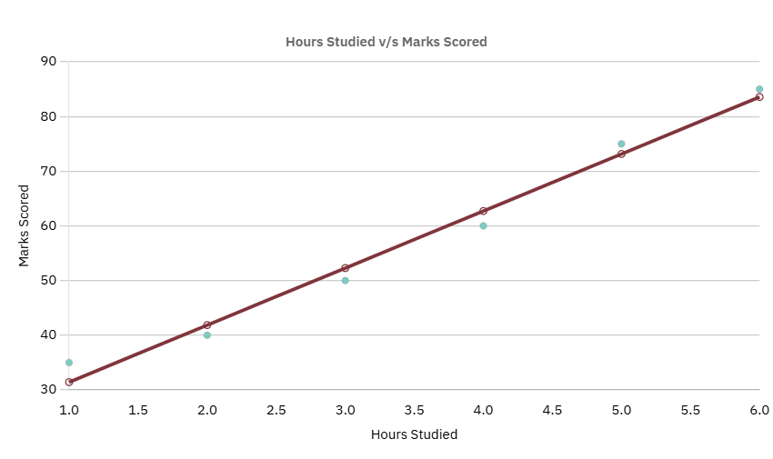
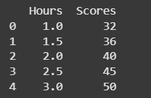
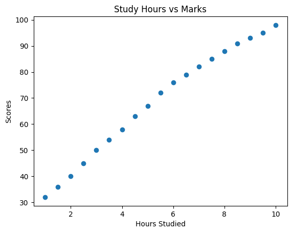
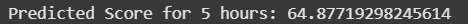
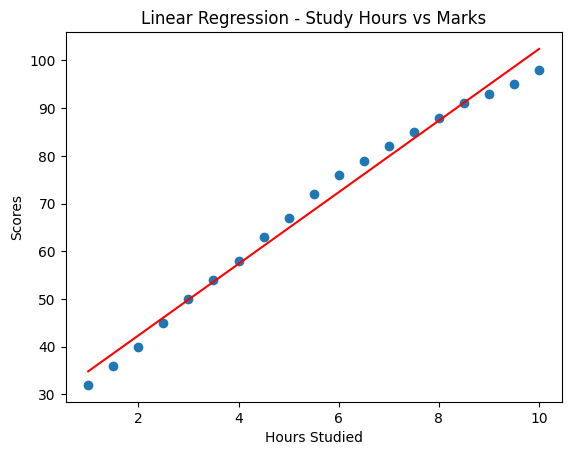

# YOUR FIRST DATA SCIENCE PROJECT: FROM CSV TO GRAPHS IN PYTHON

So you’ve heard about Data Science everywhere—Netflix uses it, doctors use it, even sports teams use it. But how do you get started? Don’t worry, you don’t need a PhD or fancy math to begin.


Today, we’ll do a super simple project:
1. Load Data  
2. Train a basic model  
3. Draw a graph  


---

## Agenda (Structure of this Blog)

Here’s what we’ll cover:

- Setting up our environment (installing the right tools)
- What Pandas is
- What Linear Regression is
- What Scikit-learn is
- What Matplotlib is
- Building a mini project (Predicting student marks from study hours)
- Datasets you can download and try yourself

---

## Setting Up the Environment

Before we start, we need a few libraries. Open your terminal/command prompt and run:

```bash
pip install pandas scikit-learn matplotlib
```

If you’re using Jupyter Notebook, run this inside a cell:

```python
!pip install pandas scikit-learn matplotlib
```

What each library does:
- **Pandas** → Work with data tables (like Excel in Python).
- **Scikit-learn** → Machine learning algorithms (we’ll use Linear Regression).
- **Matplotlib** → Make charts and graphs.

---

## What is Pandas?

Pandas is a Python library that helps you work with data easily. The name comes from “Panel Data”, not the cute animal 🐼 (though the logo is a panda!). Think of it as Excel inside Python.

At its core, Pandas gives you two main data structures:
- **Series** → like a single column of data (with labels).
- **DataFrame** → like a spreadsheet or SQL table (rows + columns, with labels and indexes).

Some common use cases:
- **Data loading:** Read files directly from CSV, Excel, SQL, JSON, or even APIs. -> you will see in this blog.
- **Data cleaning:** Handle missing values, rename columns, convert data types, remove duplicates. -> topic for next blog
- **Data wrangling:** Filter rows (e.g., all customers from Bangalore), create new calculated columns, merge/join multiple datasets.
- **Data summarization:** Group by categories (e.g., average sales per region), calculate aggregates (mean, median, min, max, counts).
- **Time series analysis:** Perfect for working with dates, times, and indexed data. -> pandas is widely used for this and this is one of the primary reaons pandas became so popular.
- **Integration:** Works seamlessly with NumPy, Matplotlib, Seaborn, and Scikit-Learn for data science and machine learning. -> you will see integration with Scikit-Learn and Matplotlib in this blog.

Why Not Just Use Excel?

Think of Pandas as Excel on steroids:
- It can handle much larger datasets (millions of rows).
- You can automate repetitive tasks instead of clicking around.
- It’s easier to track and reproduce your analysis since everything is code.
- It integrates with the entire Python ecosystem — so you can go from raw data → cleaning → analysis → visualization → machine learning, all in one place.



👉 In short: **Pandas makes handling data simple.**


---

## What is Linear Regression?

Linear regression is one of the simplest machine learning algorithms. It tries to model the relationship between a dependent variable (what you want to predict) and one or more independent variables (the inputs) by fitting a straight line.
- If there is only one input variable, it’s called Simple Linear Regression.
- If there are two or more input variables, it’s called Multiple Linear Regression.

The mathematical equation of a line is
y = mx + c

Imagine you want to predict your marks based on how many hours you study. If you plot hours studied vs marks, the points may look like they form a line.

Linear regression simply draws the **best straight line** through those points to make predictions.

### 📊 Example: Hours vs. Marks
Suppose we collected data from 6 students:

| Hours Studied | Marks Scored |
|---------------|--------------|
| 1 | 35 |
| 2 | 40 |
| 3 | 50 |
| 4 | 60 |
| 5 | 75 |
| 6 | 85 |

First, we can plot this data as a scatter plot:



Then, we fit a **linear regression line**:



👉 As you can see, the red line is the **“best fit line”**. If a new student studies 5 hours, we can use this line to **predict their marks** (around 75).

You can practice some problems on Linear Regression here: 

📂 [Linear Regression Problems](linear_regression_practice_problems.md)

---

## What is Scikit-learn?

Scikit-learn is a machine learning library in Python. It gives us ready-to-use tools like:

- Linear Regression
- Decision Trees
- Clustering
- Model evaluation

👉 Instead of writing algorithms from scratch, we can just use scikit-learn and focus on solving problems.

---

## What is Matplotlib?

Matplotlib is a visualization library. It helps us make graphs and plots so we can **see patterns in data**.

- Line plots 
- Bar charts 
- Scatter plots

👉 Data is easier to understand when you can see it visually.

---

## Mini Project: Predicting Student Marks

Now let’s bring everything together.

### Step 1: Download Dataset

Here’s a simple dataset you can use (CSV file):

📂 [Download Student Scores Dataset](Datasets/studentscores.csv)

This dataset has:
- **Hours** → How many hours a student studied
- **Scores** → The marks they scored

---

### Step 2: Load the Dataset

We’ll use Pandas to read it: 

```python
import pandas as pd

# Load dataset
data = pd.read_csv("student_scores.csv")

# Show first 5 rows
print(data.head())
```
Output:


---

### Step 3: Visualize the Data

```python
import matplotlib.pyplot as plt

plt.scatter(data["Hours"], data["Scores"])
plt.xlabel("Hours Studied")
plt.ylabel("Scores")
plt.title("Study Hours vs Marks")
plt.show()
```

Output:


---

### Step 4: Train Linear Regression Model

```python
from sklearn.linear_model import LinearRegression

X = data[["Hours"]]   # Features
y = data["Scores"]    # Target

model = LinearRegression()  #Creates a new Linear Regression model (like an empty calculator that doesn’t know anything yet).

model.fit(X, y)

# Predict for 5 hours of study
pred = model.predict([[5]])  #Take x = 5 (hours studied), plug it into the best-fit line equation (y = m×x + c), and give me the predicted y (marks).
print("Predicted Score for 5 hours:", pred[0])
```

Output:


---

### Step 5: Plot the Regression Line

```python
line = model.coef_ * X + model.intercept_

plt.scatter(X, y)
plt.plot(X, line, color="red")
plt.xlabel("Hours Studied")
plt.ylabel("Scores")
plt.title("Linear Regression - Study Hours vs Marks")
plt.show()
```

Output:


---

## Try It Yourself!

📂 Dataset Link again: [Student Scores CSV](Datasets/studentscores.csv)

Now it’s your turn! Try changing the dataset, like predicting:
- [House prices](Datasets/house_prices.csv) 
- [Salary vs experience](Datasets/salary_data.csv) 
- [Calories burned vs exercise duration](Datasets/calories_burned.csv) 

And that’s it! You just built your first machine learning model 🎉
